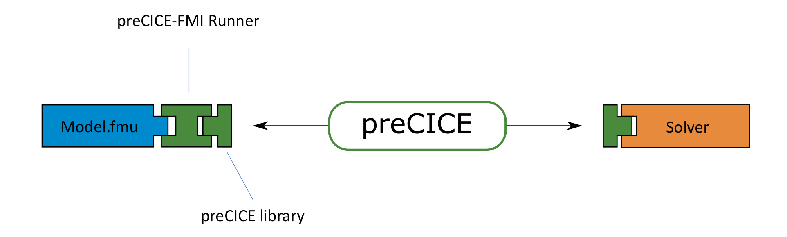

# preCICE-FMI Runner

The [Functional Mock-Up Interface](https://fmi-standard.org/) (FMI) is a standard for the exchange of dynamic simulation models. Currently, it is the de-facto industry standard for co-simulation. The models implementing the FMI standard are called Functional Mock-Up Units (FMU).

This project aims to couple FMU models with other simulation tools with the coupling library [preCICE](https://precice.org/). To this end, a preCICE-FMI Runner is being developed (see image). The Runner serves as an importer for the FMU to steer the simulation. Additionally, it calls the preCICE library to communicate and coordinate with other solvers. 



## Dependencies

* Python 3 or higher
* [preCICE](https://github.com/precice/precice/wiki)
* [pyprecice: Python language bindings for preCICE](https://github.com/precice/python-bindings)
* [numpy](https://numpy.org/install/)
* [fmpy](https://fmpy.readthedocs.io/en/latest/install/)

## Installation 

First, clone this repository and open a terminal in the `fmi-runner` directory.

To use **pip** for the installation, run the command:

```bash
pip3 install --user -e .
```

The editable flag `-e` allows you to update the Runner by simply pulling the repository.

To use **Python** for the installation, run the command:

```bash
python setup.py install --user
```

## Usage

The Runner is called from the terminal with the command `fmiprecice`. It takes two input files, one with settings for the FMU simulation and one with settings for preCICE. Start the runner by pointing to the input files:

```bash
fmiprecice ./fmi-settings.json ./precice-settings.json
```

You can find more information about the Runner, its abilities and limitations in [1]. The preCICE [Oscillator tutorial](https://github.com/precice/tutorials/tree/master/oscillator) will feature a first complete setup with FMU model and setting files soon. 

## References

[1] L. Willeke, A preCICE-FMI Runner to couple controller models to PDEs, Master Thesis, University of Stuttgart, 2023 (Publication pending)

